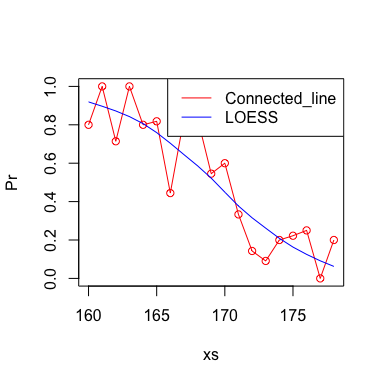

LOESS
================
Yiting
2025-08-13

Visualize the the probability of being ‘Heights between 160 and 178’
with: 1 Connected_line (raw probability values) 2 Smoothing via LOESS

``` r
n = 10000                    # sample_size
N = 250                      # reduced_sample_size
set.seed(1)
men = rnorm(n,176,7) 
women = rnorm(n,162,7) 
y = c(rep(0,n),rep(1,n))
x = round(c(men,women))
set.seed(5)
ind = sample(length(y),N)    # random ordering
Y = y[ind]
X = x[ind]

height_lo <- loess(Y ~ X)
predict(height_lo, data.frame(X = 168))
```

    ##         1 
    ## 0.5863826

``` r
xs = seq(160,178)
Pr =sapply(xs,function(x0) mean(Y[X==x0]))
plot(xs, Pr, type = c('o'), col='red')
fitted=predict(height_lo,newdata=data.frame(X=xs))
lines(xs,fitted,col='blue')
legend("topright", legend = c("Connected_line", "LOESS"), 
       col=c("red", "blue"), lty= 1)
```

<!-- -->
